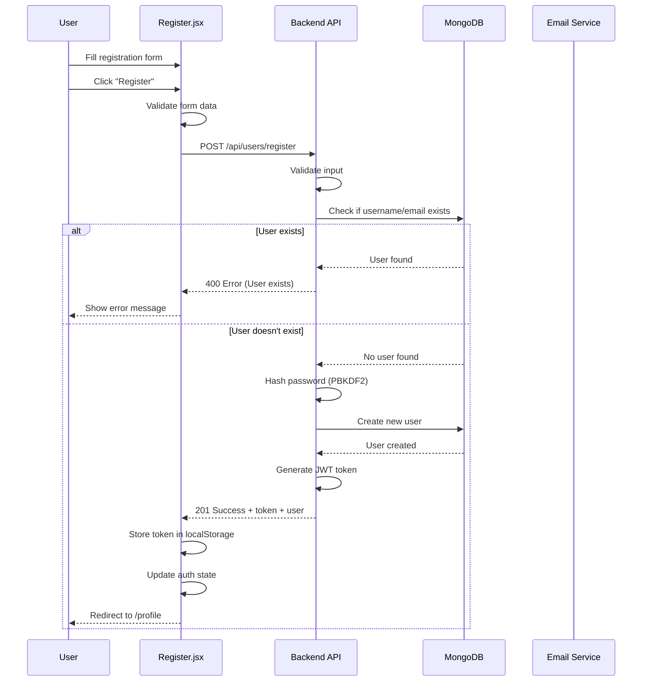
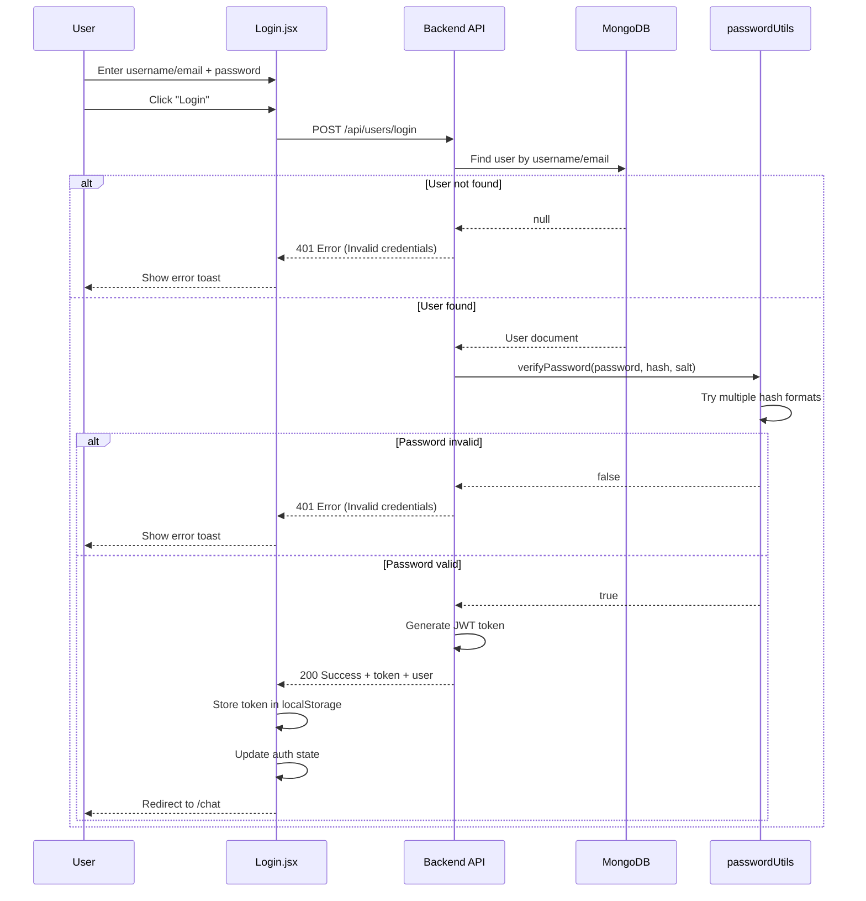
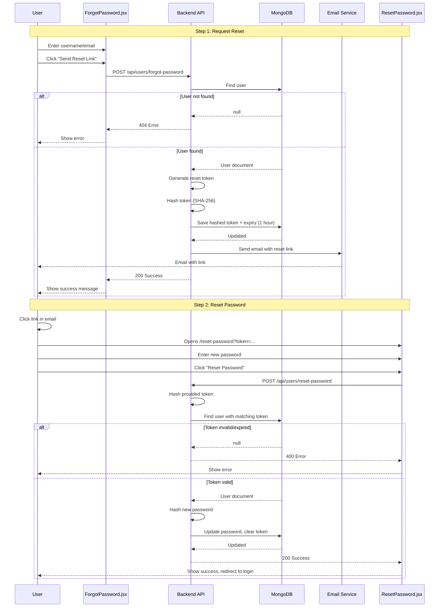
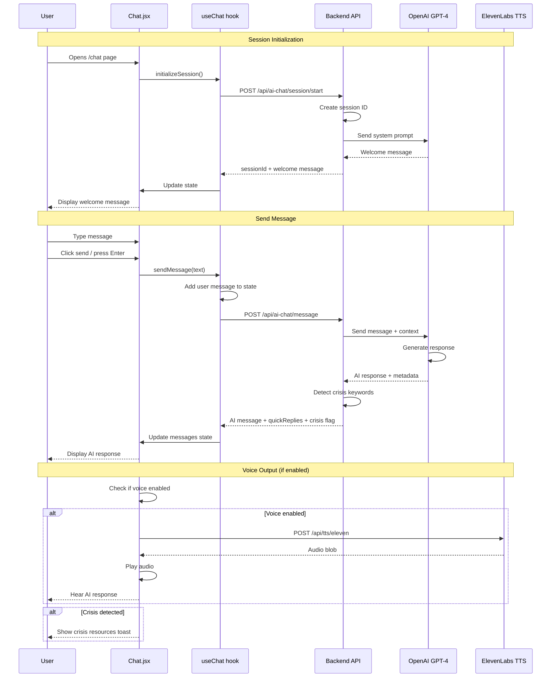
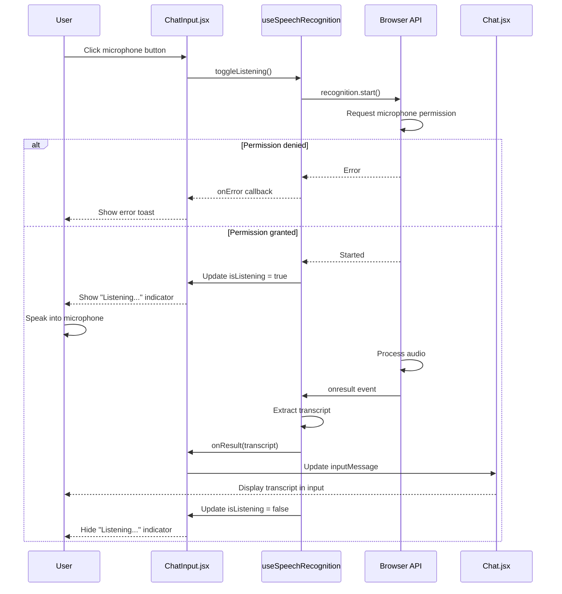
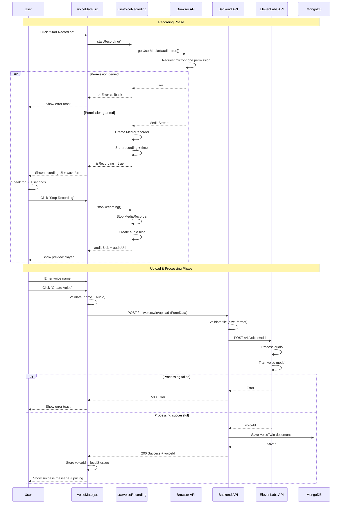
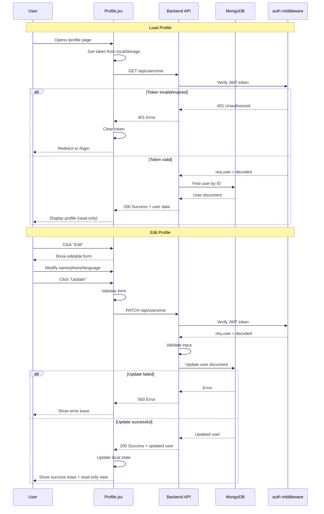
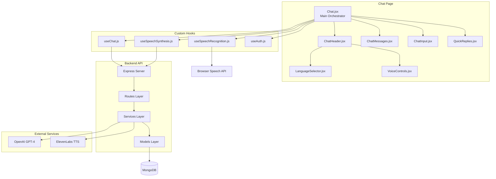
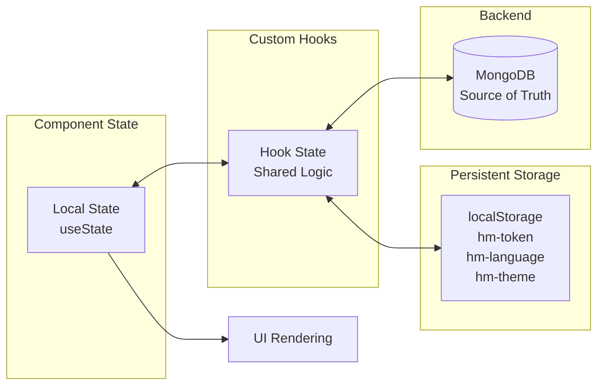

# HearMe Flow Diagrams

This document contains visual flow diagrams for major features in the HearMe application.

## Table of Contents
1. [User Registration Flow](#user-registration-flow)
2. [User Login Flow](#user-login-flow)
3. [Password Reset Flow](#password-reset-flow)
4. [Chat Session Flow](#chat-session-flow)
5. [Voice Input Flow](#voice-input-flow)
6. [Voice Cloning Flow](#voice-cloning-flow)
7. [Profile Update Flow](#profile-update-flow)

## User Registration Flow

## User Login Flow

## Password Reset Flow

## Chat Session Flow

## Voice Input Flow

## Voice Cloning Flow

## Profile Update Flow

## Component Interaction Diagram

## State Management Flow

